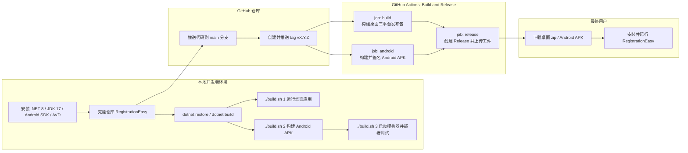

# dotnet10 + Avalonia11 跨平台桌面 + Android 应用实现方案

> 以 RegistrationEasy 项目为例的实践总结

---

## 1. 整体目标与方案概览

- 使用 `.NET 10` + `Avalonia 11` 搭建一个统一 UI 的跨平台应用：
  - 桌面端：Windows / Linux / macOS
  - 移动端：Android
- 采用 MVVM 模式（`CommunityToolkit.Mvvm`）构建 UI 与业务逻辑。
- 通过 `build.sh` 脚本封装构建与部署流程。
- 使用 GitHub Actions 实现持续集成（构建 / 测试 / 产出包）。

### 1.1 快速上手（TL;DR）

以下步骤面向已经拉取本仓库代码的开发者，在 **Windows + Git Bash** 或类 Unix 环境下执行。

1. 在项目根目录快速检查核心环境：

   ```bash
   dotnet --info
   java -version
   adb version
   emulator -list-avds
   ```

2. 首次还原依赖并构建一次解决方案（桌面 + Android）：

   ```bash
   dotnet restore
   dotnet build -c Release
   ```

3. 快速运行桌面版（Windows / Linux / macOS）：

   ```bash
   ./build.sh 1
   ```

4. 构建 Android APK（仅构建，不启动模拟器）：

   ```bash
   ./build.sh 2
   ```

5. 启动 Android 模拟器并自动构建、安装和运行应用：

   ```bash
   ./build.sh 3
   ```

6. 如遇问题，优先参考：
   - 第 2 章：环境搭建与依赖（.NET / JDK / Android SDK / AVD）
   - 第 6 章：`build.sh` 脚本功能与使用流程
   - 第 7 章：常见报错与排查

---

## 2. 环境搭建与依赖

### 2.1 操作系统建议

- 开发环境：
  - Windows 10/11（本项目实际环境）
  - 或 Linux / macOS（均可作为开发端）
- 目标运行环境：
  - Windows / Linux / macOS 桌面
  - Android 8+ 设备或模拟器

### 2.2 安装 .NET SDK

- 推荐版本：
  - `.NET SDK 10.x`（例如：`10.0.101` 等 LTS 版本）
- 下载地址：
  - https://dotnet.microsoft.com/en-us/download/dotnet/10.0
- 安装完成后验证：
  ```bash
  dotnet --info
  ```

### 2.3 开发工具（IDE / 编辑器）

- Visual Studio 2022（Windows）
  - 安装工作负载：
    - `.NET 桌面开发`
    - `.NET 跨平台开发`
    - `使用 .NET 的移动开发`（包含 Android 工具与 SDK）
- JetBrains Rider / VS Code（跨平台）
  - 搭配 .NET SDK 与 C# 插件即可。

### 2.4 Avalonia 相关依赖

- 核心包（示例版本均为 `11.3.9`，需保持一致）：
  - `Avalonia`
  - `Avalonia.Desktop`
  - `Avalonia.Android`
  - `Avalonia.Themes.Fluent`
  - `Avalonia.Fonts.Inter`
- MVVM：
  - `CommunityToolkit.Mvvm`（例如 `8.2.1`）

示例（共享项目 `RegistrationEasy.Common` 的依赖）：

```xml
<ItemGroup>
  <PackageReference Include="Avalonia" Version="11.3.9" />
  <PackageReference Include="Avalonia.Themes.Fluent" Version="11.3.9" />
  <PackageReference Include="Avalonia.Fonts.Inter" Version="11.3.9" />
  <PackageReference Include="CommunityToolkit.Mvvm" Version="8.2.1" />
</ItemGroup>
```

> 重点：**所有 Avalonia 相关包的版本必须统一**，否则容易出现编译 / 运行时不一致的问题（例如 XAML 预编译失败）。

### 2.5 Android 开发环境与模拟器

- 安装 Android Studio（用于 SDK 管理与模拟器管理）。
- 安装以下组件：
  - Android SDK Platform（目标 API 级别，如 33）
  - Android SDK Build-Tools
  - Android Emulator
  - 相应的系统镜像（如：Android 13 x86_64）
- 配置环境变量（Windows 示例）：
  - `ANDROID_SDK_ROOT` 指向 Android SDK 根目录
  - 将 `platform-tools`（包含 `adb`）加入 `PATH`
- 验证：
  ```bash
  adb version
  emulator -list-avds
  ```

### 2.6 Android 环境详细要求与构件版本

下面以 Windows + Git Bash 环境为例，给出能够满足本项目和 `build.sh` 的完整 Android 环境配置要求。

#### 2.6.1 JDK 要求

- 推荐：`JDK 17`（LTS），可使用：
  - Microsoft OpenJDK 17
  - 或 Oracle JDK 17
- 安装完成后：
  - 配置 `JAVA_HOME` 指向 JDK 根目录，例如：
    - `C:\Program Files\Microsoft\jdk-17`
  - 将 `%JAVA_HOME%\bin` 加入系统 `PATH`。
- 验证命令：
  ```bash
  java -version
  ```

#### 2.6.2 Android SDK 与构件版本

- 推荐通过 Android Studio 的 SDK Manager 安装 SDK。
- 本项目建议至少安装：
  - Android SDK Platform：
    - 目标 API：`Android 13 (API 33)` 或以上。
  - Android SDK Build-Tools：
    - 安装一到多个版本，例如：`33.0.2` 或 `34.0.0`。
  - Android SDK Platform-Tools：
    - 提供 `adb`。
  - Android Emulator：
    - 提供 `emulator`。
  - System Images：
    - 至少一个 x86_64/arm64 镜像，如 `Android 13 x86_64 Google APIs`。

#### 2.6.3 SDK 安装路径与环境变量

- `build.sh` 中写死了一个默认 SDK 根路径（节选自脚本）：
  ```bash
  ANDROID_SDK_ROOT="D:\programfiles\Android\SDK"
  ```
- 可选方案：
  - 将 SDK 安装或移动到 `D:\programfiles\Android\SDK`。
  - 或按实际安装路径修改 `build.sh` 顶部的 `ANDROID_SDK_ROOT`，例如：
    ```bash
    ANDROID_SDK_ROOT="C:\Users\<用户名>\AppData\Local\Android\Sdk"
    ```
- 系统环境变量建议：
  - `ANDROID_SDK_ROOT`：指向 SDK 根目录。
  - `PATH` 包含：
    - `%ANDROID_SDK_ROOT%\platform-tools`（adb）
    - `%ANDROID_SDK_ROOT%\emulator`（emulator）

在 Git Bash 中可快速检查：

```bash
echo "$ANDROID_SDK_ROOT"
adb version
emulator -list-avds
```

#### 2.6.4 AVD（模拟器）与硬件加速

- 使用 Android Studio 的 Device Manager 创建至少一个 AVD：
  - 设备：Pixel 4 / Pixel 5 等。
  - 系统镜像：Android 13 x86_64 Google APIs。
- 确保：
  - `emulator -list-avds` 能列出该 AVD。
  - 手动启动一次可以正常开机，不黑屏、不卡死。
- 硬件加速建议：
  - 开启 CPU 虚拟化（BIOS/UEFI 中启用 Intel VT-x / AMD-V）。
  - Intel CPU：可使用 HAXM（旧方案）或启用 Hyper-V / WSL2 加速。
  - AMD CPU：使用 Emulator 自带的 WHPX/Hyper-V 加速。
- `build.sh` 中的 `check_system_info` 会执行：
  ```bash
  "$EMULATOR_PATH" -accel-check
  ```
  用于检测当前加速支持情况。

---

## 3. 项目组织结构

以 `RegistrationEasy` 为例的推荐结构：

```text
RegistrationEasy/
  RegistrationEasy.Common/      # 共享业务逻辑 + 视图 + ViewModel
  RegistrationEasy.Desktop/     # 桌面端启动项目（Windows/Linux/macOS）
  RegistrationEasy.Android/     # Android 启动项目
  build.sh                      # 统一构建与部署脚本（*nix/bash 环境）
```

### 3.1 共享项目 `RegistrationEasy.Common`

- 目标框架：`net10.0`
- 主要职责：
  - 定义 `App`（Application 入口）
  - 注册主窗口 / 页面
  - 定义所有 XAML 视图 & ViewModel
  - 包含共享资源（图标、样式等）
- 特点：
  - 仅依赖 Avalonia + MVVM，不直接引用平台特有 API。
- 典型项目文件（简化示例）：

  ```xml
  <Project Sdk="Microsoft.NET.Sdk">
    <PropertyGroup>
      <TargetFramework>net10.0</TargetFramework>
      <Nullable>enable</Nullable>
      <LangVersion>latest</LangVersion>
      <AvaloniaUseCompiledBindingsByDefault>true</AvaloniaUseCompiledBindingsByDefault>
    </PropertyGroup>

    <ItemGroup>
      <PackageReference Include="Avalonia" Version="11.3.9" />
      <PackageReference Include="Avalonia.Themes.Fluent" Version="11.3.9" />
      <PackageReference Include="Avalonia.Fonts.Inter" Version="11.3.9" />
      <PackageReference Include="CommunityToolkit.Mvvm" Version="8.2.1" />
    </ItemGroup>

    <ItemGroup>
      <AvaloniaResource Include="Assets\**" />
    </ItemGroup>
  </Project>
  ```

> 这里共享项目使用 **纯 C# 初始化 Application** 的方式，避免 XAML 入口文件带来的编译冲突（例如 Duplicate x:Class）。

### 3.2 桌面项目 `RegistrationEasy.Desktop`

- 目标框架：`net8.0`
- 主要职责：
  - 提供 `Main` 入口，调用 Avalonia AppBuilder 启动应用。
  - 配置平台相关选项（如窗口图标、窗口大小等）。
- 依赖：
  - 引用 `RegistrationEasy.Common` 项目。
  - 引用 `Avalonia.Desktop`。

### 3.3 Android 项目 `RegistrationEasy.Android`

- 目标框架：`net10.0-android`
- 主要职责：
  - 提供 `MainActivity` 作为 Android 入口。
  - 调用 Avalonia Android 入口启动共享 `App`。
- 依赖：
  - 引用 `RegistrationEasy.Common`。
  - 引用 `Avalonia.Android`。

示例关键点：

- `MainActivity` 继承自 Avalonia 的 Activity 基类，内部调用 `AppBuilder`，指向共享项目的 `App` 类型。
- `Resources/values/styles.xml` 需使用兼容的 AppCompat 主题（下文有坑点说明）。

---

## 4. 项目功能与 UI 设计（RegistrationEasy）

### 4.1 功能概览

- 典型业务场景：根据“机器码”生成 / 校验“注册码”，并展示解码结果。
- 主界面主要元素：
  - `Machine Code`：只读显示当前设备的机器码。
  - `Registration Code`：多行输入框，输入注册码。
  - `Verify Code` 按钮：触发验证逻辑。
  - `Decoded Result` 区域：显示解析后的信息（如 Machine ID）。
  - 底部操作按钮：`Purchase Code`（购买）与 `About`（关于）。

### 4.2 主界面布局（桌面 + Android 统一）

- 布局原则：
  - 信息层级清晰：输入 → 操作 → 结果 → 其他操作。
  - 兼顾桌面与手机竖屏使用体验。
- 最终布局结构：
  - 顶部：应用标题 + 版本号（例如 `RegistrationEasy v1.0.0`）。
  - 中间可滚动区域：
    - 机器码显示。
    - 注册码输入框。
    - `Verify Code` 按钮（紧挨着输入区域）。
    - 状态提示文本（错误 / 成功信息）。
    - 解码结果区域（带边框的 `Decoded Result` 块）。
  - 底部固定一行按钮：
    - 左侧：`Purchase Code`。
    - 右侧：`About`。
- 布局示意：

```xml
<Grid RowDefinitions="Auto,*,Auto" Margin="16">
  <!-- 顶部：标题 + 版本 -->
  <Grid Grid.Row="0" ColumnDefinitions="Auto,*">
    <!-- 标题和版本号 -->
  </Grid>

  <!-- 中间：可滚动内容区域（含 Verify 与 DecodeResult） -->
  <ScrollViewer Grid.Row="1">
    <StackPanel>
      <!-- Machine Code / Registration Code / Verify 按钮 / 状态文本 / Decoded Result -->
    </StackPanel>
  </ScrollViewer>

  <!-- 底部：Purchase + About -->
  <Grid Grid.Row="2" ColumnDefinitions="*,*">
    <!-- 左：Purchase Code，右：About -->
  </Grid>
</Grid>
```

- 手机竖屏：上中下三个区域非常清晰，内容可滚动，操作按钮固定。
- 桌面窗口：放大后仍保持内容居中、布局紧凑，不显空洞。

### 4.3 MVVM 模式

- View：
  - Avalonia XAML 界面（如 `MainView`）负责布局和控件。
- ViewModel：
  - `MainViewModel` 继承 `ObservableObject`。
  - 使用 `RelayCommand`（或等价命令实现）承载 `Verify`、`Purchase`、`About` 等操作。
- 典型绑定：
  - 文本绑定：`Text="{Binding MachineCode}"`、`Text="{Binding RegistrationCode}"`。
  - 命令绑定：`Command="{Binding RegisterCommand}"` 等。

---

## 5. 构建步骤与流程分析

### 5.1 基本构建命令

- 还原依赖：
  ```bash
  dotnet restore
  ```
- 构建整个解决方案（Debug）：
  ```bash
  dotnet build
  ```
- 构建 Release：
  ```bash
  dotnet build -c Release
  ```

### 5.2 桌面端发布示例

- 发布 Windows 单文件（可选）：
  ```bash
  dotnet publish RegistrationEasy.Desktop -c Release -r win-x64 --self-contained false
  ```
- 发布 Linux：
  ```bash
  dotnet publish RegistrationEasy.Desktop -c Release -r linux-x64 --self-contained false
  ```
- 发布 macOS：
  ```bash
  dotnet publish RegistrationEasy.Desktop -c Release -r osx-x64 --self-contained false
  ```

> 以上均使用 Avalonia Desktop 后端，无需额外 runtime 依赖（除 .NET runtime）。

### 5.3 Android 构建与 APK 生成

- 构建 Debug APK（示例，命令可能根据项目名微调）：
  ```bash
  dotnet build RegistrationEasy.Android -c Release
  ```
- 生成可安装的 APK：
  ```bash
  dotnet publish RegistrationEasy.Android -c Release -f net8.0-android
  ```
- 发布后在 `bin/Release/net8.0-android/publish` 下可找到 `.apk` 文件。

---

## 6. `build.sh` 脚本功能与使用流程

### 6.1 脚本设计目标

- 用一个脚本统一管理：
  - 构建桌面版本（多平台）
  - 构建 Android APK
  - 自动部署到 Android 模拟器或真机
- 对开发者只暴露简单子命令，如：
  - `./build.sh 1` —— 构建桌面
  - `./build.sh 2` —— 构建 Android APK
  - `./build.sh 3` —— 构建并部署到模拟器

### 6.2 典型结构示例（伪代码）

```bash
#!/usr/bin/env bash
set -e

GREEN="\033[0;32m"
RED="\033[0;31m"
NC="\033[0m"

build_desktop() {
  echo -e "${GREEN}Building desktop targets...${NC}"
  dotnet publish RegistrationEasy.Desktop -c Release -r win-x64 --self-contained false
  # 可按需添加 linux / macOS
}

build_android() {
  echo -e "${GREEN}Building Android APK...${NC}"
  dotnet publish RegistrationEasy.Android -c Release -f net8.0-android
}

run_android() {
  echo -e "${GREEN}Checking for Android Emulator...${NC}"
  # 1. 检测 emulator 是否可用
  # 2. 启动指定 AVD（如果未启动）
  # 3. 使用 adb 安装 & 启动 APK
}

case "$1" in
  1) build_desktop ;;
  2) build_android ;;
  3) build_android && run_android ;;
  *) echo "Usage: $0 {1|2|3}" ;;
esac
```

### 6.3 使用流程示例

1. 确认已安装 .NET 10、Android SDK、adb 等。
2. 在项目根目录给予脚本执行权限：
   ```bash
   chmod +x build.sh
   ```
3. 构建桌面：
   ```bash
   ./build.sh 1
   ```
4. 构建 Android APK：
   ```bash
   ./build.sh 2
   ```
5. 构建并尝试安装到模拟器：
   ```bash
   ./build.sh 3
   ```

> 若 `./build.sh 3` 报错，多数与 **模拟器/adb 环境** 有关，而非项目代码本身（例如：AVD 未创建、模拟器未启动、设备未连接等）。

### 6.4 `build.sh` 对 Android 环境的依赖

结合脚本内容，可以看出本项目在 Android 侧的所有依赖都是通过 `build.sh` 串起来的：

- 顶部路径配置（节选）：

  ```bash
  ANDROID_SDK_ROOT="D:\programfiles\Android\SDK"

  if [[ "$OSTYPE" == "msys" || "$OSTYPE" == "cygwin" ]]; then
      ANDROID_SDK_PATH=$(cygpath -u "$ANDROID_SDK_ROOT")
  else
      ANDROID_SDK_PATH="$ANDROID_SDK_ROOT"
  fi

  EMULATOR_PATH="$ANDROID_SDK_PATH/emulator/emulator.exe"
  ADB_PATH="$ANDROID_SDK_PATH/platform-tools/adb.exe"
  ```

  - 这里要求 `ANDROID_SDK_ROOT` 指向一个**真实存在**的 SDK 目录。
  - 通过 `cygpath` 把 Windows 路径转为 Bash 可用路径后，拼出 `EMULATOR_PATH` 和 `ADB_PATH`。

- `check_system_info` 中检查：

  - SDK 目录是否存在，以及 `build-tools` 版本。
  - `ADB_PATH` 或系统 PATH 中是否有 `adb`，并输出 `adb version`。
  - `EMULATOR_PATH` 是否存在。
  - `java -version` 是否可用（也就是 JDK 是否装好，并在 PATH 中）。
  - `"$EMULATOR_PATH" -accel-check`，检查当前硬件加速支持情况。

- `build_android` / `run_android` 中使用：

  - 先构建 `RegistrationEasy.Common` 和 `RegistrationEasy.Android`：
    ```bash
    dotnet build "$COMMON_PROJECT" -c Release
    dotnet build "$ANDROID_PROJECT" -c Release
    ```
  - 在 `RegistrationEasy.Android/bin` 下查找生成的 `.apk`。
  - 在有 `build-tools` 的情况下，还会查找 `aapt.exe` 来分析 APK 中的 native 库架构。

- `run_android` 中依赖 emulator 与 adb：
  - 用 `"$EMULATOR_PATH" -list-avds` 列出 AVD，并选择第一个。
  - 如果没有已有设备，则启动 AVD，并使用：
    ```bash
    "$ADB_PATH" wait-for-device
    ```
    等待设备准备就绪。
  - 用 `"$ADB_PATH" -s "$DEVICE_ID" shell getprop sys.boot_completed` 轮询等待系统启动完成。
  - 完成后：
    - 卸载旧版本：`adb uninstall "$APP_ID"`。
    - 安装新 APK：`adb install -r "$SIGNED_APK"`。
    - 启动主 Activity：`adb shell am start -n "$APP_ID/$APP_ID.MainActivity"`。
    - 通过 `adb logcat` 监控错误日志。

总结来说：

- 只要按照第 2 章把 `.NET SDK / JDK / ANDROID_SDK_ROOT / AVD` 配置正确，`./build.sh 2` 和 `./build.sh 3` 就能直接利用这些环境完成 Android APK 的构建、部署和调试。
- 如果 `./build.sh 3` 失败，优先检查：
  - `ANDROID_SDK_ROOT` 是否指向正确目录；
  - `adb version`、`emulator -list-avds` 是否正常；
  - 是否存在至少一个可用 AVD 并能正常启动。

---

## 7. 常见报错与排查

本节结合 RegistrationEasy 项目实践中的典型问题。

### 7.1 AVLN2002 Duplicate x:Class 错误

**现象：**

- 编译时出现类似错误：

  > AVLN2002 Duplicate x:Class ...

**原因：**

- Avalonia 的 XAML 编译器在处理 `App.axaml` / `Window.axaml` 等时，发现同一个 `x:Class` 对应多个定义。
- 在本项目中，主要是：
  - 既有 XAML 定义的 `App.axaml`，又有纯 C# 定义的 `App` 类型。
  - 或者 `.csproj` 中对 Avalonia 资源的配置重复、过度复杂。

**解决思路：**

1. **选择单一方式初始化 Application**：
   - 在 RegistrationEasy 中，最终采用 **纯 C# 初始化 `App`**：
     - 保留 `App.axaml.cs`（或纯 C# `App` 类）
     - 删除 `App.axaml` XAML 文件，避免 XAML 编译器处理重复类。
2. **简化 `RegistrationEasy.Common.csproj` 配置**：
   - 保留必须的 `AvaloniaResource` 项，如：
     ```xml
     <ItemGroup>
       <AvaloniaResource Include="Assets\**" />
     </ItemGroup>
     ```
   - 移除多余的 `Compile` / `AvaloniaResource` 手动配置，让 SDK 默认规则接管。
3. **确保每个 XAML 文件的 `x:Class` 唯一且不与 C# 手写类冲突**。

### 7.2 “No precompiled XAML found” 崩溃

**现象：**

- 运行时或启动时出现类似错误：
  > No precompiled XAML found for ...

**常见原因：**

- Avalonia 预编译 XAML 功能未正常工作，可能原因包括：
  - Avalonia 包版本不一致（核心库、主题库、字体库版本不统一）。
  - `.csproj` 配置异常，导致未触发 XAML 编译。
  - 资源路径或命名空间配置有误。

**解决方案：**

1. **统一版本**：
   - 将所有 Avalonia 包版本统一为 `11.3.9`（或其他同版本）。
2. **使用标准 `.csproj` 模板**：
   - 避免大量手工配置 `AvaloniaResource`、`Compile` 等，除非确有必要。
   - 使用官方模板生成的项目作为参考，逐项对比。
3. **清理旧 XAML 文件**：
   - 若已改用纯 C# 初始化 `App`，则删除对应的 `App.axaml`，避免半残 XAML 入口。
4. **确保 `EnableDefaultAvaloniaItems` 等保持默认或与模板一致**（如未显式关闭）。

### 7.3 Android 主题错误与样式问题

**现象：**

- Android 项目在构建或运行时出现主题相关错误：
  - 如找不到某主题、样式不兼容、崩溃等。

**本项目中的关键修改：**

- 编辑 `RegistrationEasy.Android/Resources/values/styles.xml`：
  - 使用 `Theme.AppCompat` 系列主题，确保与 Avalonia.Android 兼容。

示例：

```xml
<resources>
  <style name="MyTheme.NoActionBar" parent="Theme.AppCompat.Light.NoActionBar">
    <item name="windowNoTitle">true</item>
    <item name="windowActionBar">false</item>
    <item name="android:windowFullscreen">true</item>
    <item name="android:windowContentOverlay">@null</item>
  </style>
</resources>
```

**注意：**

- 若继承不兼容的主题（如某些 Material3 变体），可能导致 Avalonia Host 初始化失败。
- 保持主题配置与 Avalonia 官方 Android 模板接近是最稳妥做法。

### 7.4 `build.sh 3` 运行失败的原因分析

**现象：**

- `./build.sh 3` 在某些环境下失败，但构建本身通过。
- 日志显示问题集中在 `emulator` 或 `adb` 阶段。

**结论：**

- 失败根因不在项目代码，而在 **Android 模拟器环境**：
  - 未创建 AVD
  - 模拟器未启动
  - `adb` 未识别到任何设备
- 验证方式：
  ```bash
  adb devices
  emulator -list-avds
  ```

**解决建议：**

- 使用 Android Studio 创建并手动启动一个 AVD。
- 确保 `adb` 能列出该设备后，再执行 `./build.sh 3`。
- 若仍有问题，可在脚本中增加更多日志输出（如 `adb devices` 结果）。

### 7.5 `build.sh` 典型失败场景与排查

以下是实际调试 RegistrationEasy 时总结出的几类 `build.sh` 典型失败场景，均可通过日志中的关键字快速定位。

#### 场景一：`Error: Emulator not found at ...`

- 触发命令：
  ```bash
  ./build.sh 3
  ```
- 典型日志片段：
  ```text
  Emulator:        Not found
  Error: Emulator not found at D:/programfiles/Android/SDK/emulator/emulator.exe
  ```
- 根因分析：
  - `ANDROID_SDK_ROOT` 指向了错误的目录，或该目录下缺少 `emulator/emulator.exe`。
  - 仅安装了部分 SDK 组件，没有勾选 **Android Emulator**。
  - 在 Git Bash 中路径转换异常，导致 `EMULATOR_PATH` 指向不存在的路径。
- 排查步骤：
  1. 打开 `build.sh` 顶部确认：
     ```bash
     ANDROID_SDK_ROOT="D:\programfiles\Android\SDK"
     ```
     确保该目录真实存在。
  2. 在资源管理器中确认 `D:\programfiles\Android\SDK\emulator\emulator.exe` 是否存在。
  3. 打开 Android Studio → `SDK Manager`：
     - 确认已勾选 `Android Emulator`。
  4. 在 Git Bash 中执行：
     ```bash
     "$EMULATOR_PATH" -version
     ```
     若仍报错，说明路径仍有问题，需要重新校正 `ANDROID_SDK_ROOT`。

#### 场景二：`No AVD found. Please create one in Android Device Manager.`

- 触发命令：
  ```bash
  ./build.sh 3
  ```
- 典型日志片段：
  ```text
  No AVD found. Please create one in Android Device Manager.
  ```
- 根因分析：
  - 脚本通过：
    ```bash
    "$EMULATOR_PATH" -list-avds | head -n 1
    ```
    没有拿到任何 AVD 名称，即本机尚未创建任何模拟器设备。
  - 或 AVD 全部被删除 / 移动到非默认目录。
- 排查步骤：
  1. 在命令行手动确认：
     ```bash
     emulator -list-avds
     ```
     如果输出为空，与脚本中的行为一致。
  2. 打开 Android Studio → `Device Manager`：
     - 创建至少一个 AVD，例如：
       - 设备：Pixel 5
       - 系统镜像：Android 13 x86_64 Google APIs
  3. 再次执行：
     ```bash
     emulator -list-avds
     ```
     确保能看到刚创建的 AVD 名称。
  4. 手动启动该 AVD 一次，确认可以正常启动、不会黑屏或卡死。
  5. 重新执行：
     ```bash
     ./build.sh 3
     ```

#### 场景三：`Failed to build Common project!` / `Common Build Failed`

- 触发命令：
  ```bash
  ./build.sh 2   # 仅构建 APK
  ./build.sh 3   # 构建 + 启动模拟器
  ```
- 典型日志片段：
  ```text
  Building Common project...
  Failed to build Common project!
  ```
  或在 `./build.sh 3` 中看到：
  ```text
  Common Build Failed
  ```
- 根因分析：
  - 本质上是 `dotnet build RegistrationEasy.Common -c Release` 失败，常见原因包括：
    - AVLN2002 Duplicate x:Class（见第 7.1 节）。
    - “No precompiled XAML found for ...” 等 XAML 预编译问题（见第 7.2 节）。
    - `.csproj` 资源配置异常导致 Avalonia 生成步骤失败。
- 排查步骤：
  1. 在项目根目录手动执行：
     ```bash
     dotnet build RegistrationEasy.Common/RegistrationEasy.Common.csproj -c Release
     ```
     直接查看完整编译错误信息。
  2. 若看到 AVLN2002 相关错误，按第 7.1 节调整：
     - 确保 `App` 仅由纯 C# 定义，删除多余 `App.axaml`。
     - 简化 `RegistrationEasy.Common.csproj` 中的 Avalonia 配置。
  3. 若看到 “No precompiled XAML found ...”，按第 7.2 节检查：
     - 所有 Avalonia 包版本是否统一。
     - 是否关闭了默认 Avalonia 项目项（如 `EnableDefaultAvaloniaItems`）。
  4. 修复后再次执行：
     ```bash
     ./build.sh 2
     ./build.sh 3
     ```
     确保构建与部署均能顺利完成。

---

## 8. GitHub Actions 持续集成方案

### 8.1 目标

- 在代码推送或 PR 时自动执行：
  - 还原依赖
  - 编译项目（至少 Debug / Release 之一）
  - 可选：运行测试
  - 可选：产出可下载的构建工件（如桌面可执行文件 / APK）

### 8.2 基本工作流示例（伪代码）

```yaml
name: CI

on:
  push:
    branches: [main]
  pull_request:
    branches: [main]

jobs:
  build:
    runs-on: ubuntu-latest

    steps:
      - uses: actions/checkout@v4

      - name: Setup .NET 8
        uses: actions/setup-dotnet@v4
        with:
          dotnet-version: "8.0.x"

      - name: Restore
        run: dotnet restore

      - name: Build
        run: dotnet build -c Release

      # 可选：运行测试
      # - name: Test
      #   run: dotnet test

      # 可选：发布桌面或 Android
      # - name: Publish Desktop
      #   run: dotnet publish RegistrationEasy.Desktop -c Release -r win-x64 --self-contained false
```

> 说明：
>
> - Android 构建可在 Linux Runner 上使用 `dotnet publish` 完成，但若要运行模拟器测试则需更复杂的环境配置。
> - 实际项目中可以根据需要扩展为多个 Job，分别负责桌面和 Android。

### 8.3 与本地 `build.sh` 的关系

- CI 中可直接调用 `dotnet` 命令；也可在 Runner 上调用 `./build.sh`（前提是 Runner 的环境支持 bash/Android SDK）。
- 建议：
  - **本地开发**：以 `build.sh` 为主，快速统一构建体验。
  - **CI 中**：直接使用 `dotnet` 命令，保持配置可读性与可控性，必要时参考 `build.sh` 中的命令。

### 8.4 Android 发布工作流（含签名与 Release 集成）

本项目在 `.github/workflows/release.yml` 中，将桌面三平台与 Android APK 的构建和发布统一在一个工作流中，通过打 tag 自动触发。

#### 8.4.1 触发方式与整体结构

- 触发条件：
  - 当推送符合 `v*` 格式的 tag 时触发（例如：`v1.0.0`）。
- 主要 Job：
  - `build`：构建桌面版（Linux / Windows / macOS），打包为 zip。
  - `android`：构建并签名 Android APK。
  - `release`：等待前两个 Job 完成后，创建 GitHub Release，并附加三套桌面包和 Android APK。

工作流文件整体示例（节选，重点在 Android 相关部分）：

```yaml
name: Build and Release

on:
  push:
    tags:
      - "v*"

jobs:
  build:
    # 省略：桌面三平台构建，产生 zip 工件

  android:
    name: Build Android APK
    runs-on: ubuntu-latest

    steps:
      - name: Checkout code
        uses: actions/checkout@v4

      - name: Setup .NET
        uses: actions/setup-dotnet@v4
        with:
          dotnet-version: 8.0.x

      - name: Setup Java 17
        uses: actions/setup-java@v4
        with:
          distribution: microsoft
          java-version: "17"

      - name: Setup Android SDK
        uses: android-actions/setup-android@v3
        with:
          packages: |
            platform-tools
            platforms;android-33
            build-tools;33.0.2

      - name: Install .NET Android workload
        run: dotnet workload install android

      - name: Get Version
        id: get_version
        shell: bash
        run: |
          TAG_NAME="${GITHUB_REF#refs/tags/}"
          CLEAN_VERSION="${TAG_NAME#v}"
          echo "VERSION=$CLEAN_VERSION" >> $GITHUB_OUTPUT
          echo "TAG_NAME=$TAG_NAME" >> $GITHUB_OUTPUT

      - name: Decode Android keystore
        env:
          ANDROID_KEYSTORE_BASE64: ${{ secrets.ANDROID_KEYSTORE_BASE64 }}
        run: |
          mkdir -p RegistrationEasy.Android
          echo "$ANDROID_KEYSTORE_BASE64" | base64 -d > RegistrationEasy.Android/ci-release.keystore

      - name: Publish signed Android APK
        env:
          ANDROID_KEYSTORE_PASSWORD: ${{ secrets.ANDROID_KEYSTORE_PASSWORD }}
          ANDROID_KEY_ALIAS: ${{ secrets.ANDROID_KEY_ALIAS }}
          ANDROID_KEY_PASSWORD: ${{ secrets.ANDROID_KEY_PASSWORD }}
        run: |
          dotnet publish RegistrationEasy.Android/RegistrationEasy.Android.csproj \
            -c Release \
            -f net8.0-android \
            -p:AndroidKeyStore=true \
            -p:AndroidSigningKeyStore=RegistrationEasy.Android/ci-release.keystore \
            -p:AndroidSigningStorePass=$ANDROID_KEYSTORE_PASSWORD \
            -p:AndroidSigningKeyAlias=$ANDROID_KEY_ALIAS \
            -p:AndroidSigningKeyPass=$ANDROID_KEY_PASSWORD

      - name: Locate and rename APK
        shell: bash
        run: |
          APK_PATH=$(find RegistrationEasy.Android/bin/Release -name "*-Signed.apk" | head -n 1)
          if [ -z "$APK_PATH" ]; then
            APK_PATH=$(find RegistrationEasy.Android/bin/Release -name "*.apk" | head -n 1)
          fi
          if [ -z "$APK_PATH" ]; then
            echo "No APK found" >&2
            exit 1
          fi
          APK_NAME="RegistrationEasy-Android-${{ steps.get_version.outputs.TAG_NAME }}.apk"
          cp "$APK_PATH" "$APK_NAME"

      - name: Upload Android Artifact
        uses: actions/upload-artifact@v4
        with:
          name: android
          path: ./*.apk

  release:
    needs:
      - build
      - android
    runs-on: ubuntu-latest
    permissions:
      contents: write
    steps:
      - name: Download Artifacts
        uses: actions/download-artifact@v4

      - name: Create Release
        uses: softprops/action-gh-release@v2
        with:
          files: |
            linux/*.zip
            windows/*.zip
            macos/*.zip
            android/*.apk
          generate_release_notes: true
          draft: false
          prerelease: false
```

#### 8.4.2 CI 中使用的签名方式与 Secrets

由于不可能在仓库中直接提交 keystore 和密码，工作流通过 GitHub Secrets 注入签名信息：

- 需要配置的 Secrets（仓库 Settings → Secrets and variables → Actions）：

  - `ANDROID_KEYSTORE_BASE64`：
    - 内容为 Android keystore 文件的 base64 编码。
    - 可在本机执行：
      ```bash
      base64 -w0 RegistrationEasy.Android/registrationeasy.keystore > keystore.b64.txt
      ```
      将生成的 `keystore.b64.txt` 中整行内容复制到该 Secret。
  - `ANDROID_KEYSTORE_PASSWORD`：
    - keystore 存储密码, 例如我设置成 80fafa。
  - `ANDROID_KEY_ALIAS`：
    - keystore 中用于签名的 alias 名称,例如我设置成 80fafa。
  - `ANDROID_KEY_PASSWORD`：
    - 对应 alias 的 key 密码。

- 本项目中 keystore 的来源：

  - 本地开发时，`build.sh` 中的 `ensure_keystore` 函数会在首次运行时自动调用 `keytool` 生成 keystore：
    ```bash
    keytool -genkey -v -keystore RegistrationEasy.Android/registrationeasy.keystore \
      -alias 80fafa -keyalg RSA -keysize 2048 -validity 10000 \
      -storepass 80fafa -keypass 80fafa \
      -dname "CN=RegistrationEasy, OU=Development, O=80fafa, L=City, S=State, C=US"
    ```
  - 因此，通常只需要在本地执行一次 `./build.sh 2` 或 `./build.sh 3`，即可在 `RegistrationEasy.Android/` 下生成 `registrationeasy.keystore` 文件。
  - CI 环境中不再自动生成 keystore，而是复用这个已经存在的 keystore，将其内容通过 base64 编码后放入 GitHub Secrets。

- 工作流中的用法：
  - `Decode Android keystore` 步骤从 `ANDROID_KEYSTORE_BASE64` 解码出 `ci-release.keystore`：
    - 路径为 `RegistrationEasy.Android/ci-release.keystore`。
  - `Publish signed Android APK` 步骤通过环境变量把三组密码和别名传入 `dotnet publish`，覆盖 MSBuild 的 Android 签名参数。

这样可以做到：

- 本地开发仍然可以使用 `RegistrationEasy.Android/registrationeasy.keystore` 和 `.csproj` 中的固定配置配合 `build.sh` 调试。
- CI 发布则使用 Secrets 中的 keystore 和密码，保证生产签名信息不会泄露到仓库。

#### 8.4.3 与本地环境和 `build.sh` 的对应关系

- 环境版本对应：
  - CI 中安装的：
    - `.NET 8`（`actions/setup-dotnet@v4`）。
    - `Java 17`（`actions/setup-java@v4`，distribution 为 Microsoft）。
    - `Android SDK`：
      - `platforms;android-33` 对应文档第 2.6.2 节中的 `Android 13 (API 33)`。
      - `build-tools;33.0.2` 对应本地推荐的 Build-Tools 版本。
      - `platform-tools` 提供 `adb`。
- 构建方式对应：
  - 本地 `build.sh` 中使用：
    ```bash
    dotnet build "$ANDROID_PROJECT" -c Release
    ```
  - CI 中使用：
    ```bash
    dotnet publish RegistrationEasy.Android/RegistrationEasy.Android.csproj -c Release -f net8.0-android
    ```
  - 两者都基于同一个 Android 项目和 `net8.0-android` 目标框架，只是 CI 更偏向发布工件。
- 流程对应：
  - 本地：
    - 开发过程中通过 `./build.sh 2` 构建 APK，`./build.sh 3` 启动模拟器并部署。
  - CI：
    - 不启动模拟器，只负责在干净环境中构建、签名并产出 APK。
    - 最终在 GitHub Release 页面同时提供桌面三平台压缩包和 Android APK。

---

## 9. 当前项目状态与后续建议

### 9.1 当前技术状态（RegistrationEasy）

- `RegistrationEasy.Common`：
  - 已解决 AVLN2002 Duplicate x:Class 问题。
  - 已解决 “No precompiled XAML” 崩溃的根因。
  - 使用纯 C# 初始化 `App`，XAML 资源配置精简且稳定。
- Android 项目：
  - 能够成功构建 APK。
  - 样式主题问题已通过 `Theme.AppCompat.Light.NoActionBar` 方案解决。
- `build.sh`：
  - 能正常完成构建流程。
  - `./build.sh 3` 失败时，主要是由于本机模拟器环境问题，而非项目本身。

### 9.2 实践经验总结

- **优先保持模板一致性**：从 Avalonia 官方模板创建项目，再逐步修改，是避免配置坑的关键。
- **共享项目尽量纯净**：`RegistrationEasy.Common` 只做 UI 与业务，不掺杂任何具体平台依赖。
- **XAML 入口统一策略**：要么使用 XAML `App.axaml`，要么使用纯 C# `App`，**不要混搭**。
- **版本统一**：所有 Avalonia 包、.NET SDK 均应统一在兼容版本范围内。
- **脚本化构建**：`build.sh` 把复杂的构建和部署命令收拢成简单入口，大幅降低日常开发成本。
- **CI 与本地一致性**：GitHub Actions 流程应尽量模拟本地的构建命令，减少“只在我电脑上能跑”的情况。

---

## 10. 可以继续优化的方向

- 为桌面和 Android 分别增加 UI 自动化测试 / 单元测试。
- 在 GitHub Actions 中增加：
  - 产出 APK / 桌面包作为 artifact。
  - 针对关键平台（如 Windows / Linux）进行发布前构建验证。
- 优化 UI 布局与视觉设计（例如 `Verify code` 按钮位置、`DecodeResult` 区域布局等），确保在手机与桌面上均有良好体验。

---

## 11. 本项目完整实践过程回顾（按时间线）

本节只按时间线梳理关键决策和变化，**不再重复前文的技术细节和代码**，方便今后回顾整体过程。

### 11.1 从模板到三项目结构

- 起点：
  - 使用 Avalonia 官方模板初始化项目。
  - 初期以单项目为主，随后根据跨平台需求拆分。
- 结构演进：
  - 最终形成 `RegistrationEasy.Common` + `RegistrationEasy.Desktop` + `RegistrationEasy.Android` 的三项目结构：
    - `Common`：统一 UI 和业务逻辑。
    - `Desktop`：托管 PC 端启动。
    - `Android`：托管 Android 启动。
- 关键决策：
  - 所有 View / ViewModel 均集中在 `Common` 中，平台工程尽量只做启动和集成。

### 11.2 Application 入口与 XAML 编译稳定

- 初期尝试：
  - 同时存在 `App.axaml` 和 C# `App`，导致 XAML 编译冲突。
- 调整步骤：
  - 统一改为纯 C# Application 入口。
  - 精简 `RegistrationEasy.Common.csproj`，回到接近官方模板的配置。
  - 统一 Avalonia 包版本，清理旧的 / 冗余 XAML 入口文件。
- 结果：
  - AVLN2002 Duplicate x:Class 以及 “No precompiled XAML found” 等问题全部消失。

### 11.3 Android 主题、模拟器与 `build.sh 3`

- 主题阶段：
  - 最初主题配置与 Avalonia.Android 不兼容，导致 Android 启动异常。
  - 通过对照官方模板，统一到 `Theme.AppCompat` 系列主题后恢复正常。
- 模拟器与脚本阶段：
  - `./build.sh 3` 在构建 APK 阶段成功，但在安装 / 启动时多次失败。
  - 排查发现根因是本机模拟器 / 设备状态（无 AVD、未启动、adb 无设备）。
- 最终做法：
  - 将“构建逻辑”和“设备环境问题”清晰区分：
    - 构建失败 → 看 dotnet / MSBuild 日志。
    - 构建成功但安装失败 → 优先检查 `adb devices` 与 `emulator -list-avds`。

### 11.4 UI 布局迭代

- 初版布局：
  - 主要元素已有，但按钮与结果区域分布不够紧凑，尤其在手机上显得空。
- 多轮调整后：
  - 确定 `Verify Code` 位于 `Decoded Result` 上方，贴近输入区域。
  - `Purchase` 与 `About` 固定在底部同一行，形成明确的“操作栏”。
  - 使用滚动容器承载中间内容，兼顾小屏可见性。
- 最终效果：
  - 桌面端和 Android 端在视觉和操作流程上保持一致，体验更加自然。

### 11.5 经验小结（对应前文各章节）

- 结构：
  - 先稳定“共享层 + 启动层”的结构，再填充功能。
- 构建：
  - 本地用脚本统一构建命令，CI 中用 `dotnet` 保持清晰。
- 调试：
  - 优先确认环境和模板配置，避免在框架层反复纠结。
- UI：
  - 根据真实使用场景反复迭代布局，而不是一次定稿。

---

如需，我可以基于本 MD 文档，再导出一个更简洁的版本，适合直接作为仓库 `README`，或者按需要拆成「环境搭建篇」「项目结构篇」「CI 流程篇」等子文档。

---

## 12. 从 0 到发布：完整流水线示意（Mermaid）


